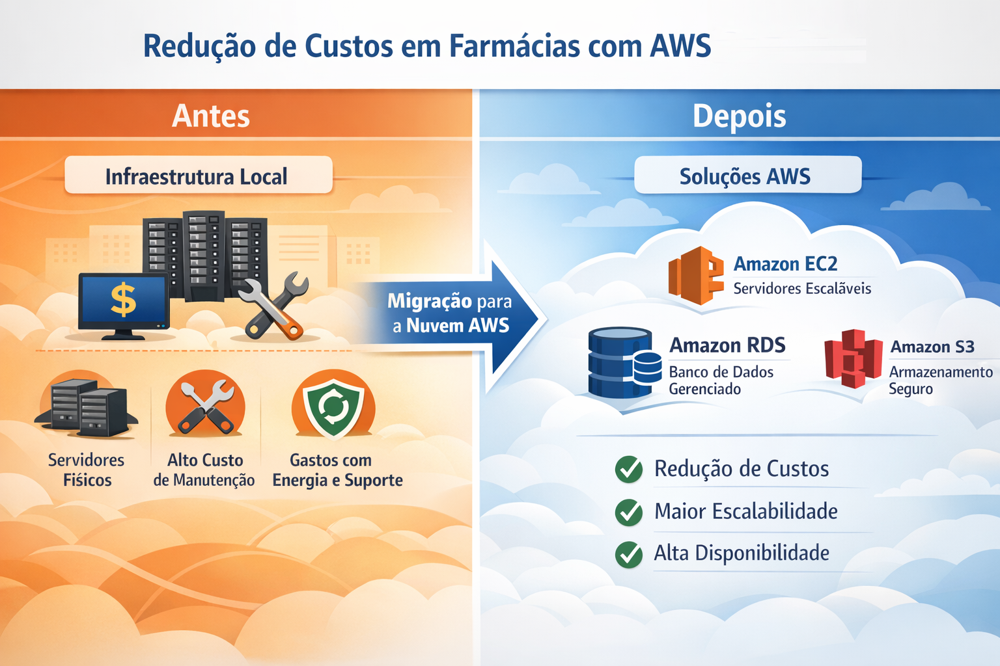

# RELATÓRIO DE IMPLEMENTAÇÃO DE SERVIÇOS AWS

Data: 11/03/2026  
Empresa: Abstergo Industries  
Responsável: Aline Mirian da Silveira  

## Introdução

Este relatório apresenta o processo de implementação de ferramentas na empresa Abstergo Industries, realizado por Aline Mirian da Silveira. O objetivo do projeto foi elencar três serviços da AWS com a finalidade de reduzir custos operacionais de infraestrutura de TI, melhorar a escalabilidade dos sistemas e aumentar a disponibilidade dos serviços utilizados pelas farmácias.
A ordem de implementação das ferramentas foi definida considerando as principais dores da empresa fictícia, priorizando primeiro as soluções que trariam maior impacto imediato na redução de custos e melhoria da infraestrutura.
A adoção de computação em nuvem permite que empresas utilizem recursos sob demanda, pagando apenas pelo que utilizam, eliminando custos com aquisição e manutenção de servidores físicos.

## Descrição do Projeto

O projeto de implementação de ferramentas foi dividido em três etapas, cada uma com objetivos específicos relacionados à redução de custos e modernização da infraestrutura.

### Etapa 1

- Nome da ferramenta: Amazon EC2  
- Foco da ferramenta: Criação de servidores virtuais escaláveis sob demanda para execução de aplicações empresariais.  
- Descrição de caso de uso:  
A primeira etapa prioriza a migração da infraestrutura de servidores físicos da empresa para instâncias virtuais no Amazon EC2. A empresa fictícia possui farmácias que dependem de sistemas para controle de estoque, registro de vendas e gestão administrativa. Ao migrar esses sistemas para servidores em nuvem, elimina-se a necessidade de aquisição e manutenção de hardware físico, além de reduzir gastos com energia elétrica, suporte técnico e infraestrutura local. Essa etapa foi priorizada por representar a maior oportunidade de redução de custos imediatos.

### Etapa 2

- Nome da ferramenta: Amazon RDS  
- Foco da ferramenta: Serviço gerenciado de banco de dados relacional que simplifica administração, backup e escalabilidade.  
- Descrição de caso de uso:  
Após a migração dos servidores para a nuvem, a segunda etapa consiste na implementação do Amazon RDS para gerenciamento do banco de dados da empresa. Esse banco armazenará informações importantes como registros de vendas, dados de clientes, controle de medicamentos e estoque das farmácias. Com o serviço gerenciado da AWS, tarefas como backup automático, atualizações e monitoramento passam a ser realizadas automaticamente, reduzindo custos operacionais e a necessidade de administração manual do banco de dados.

### Etapa 3

- Nome da ferramenta: Amazon S3  
- Foco da ferramenta: Armazenamento escalável de arquivos e backups na nuvem com alta durabilidade e baixo custo.  
- Descrição de caso de uso:  
Na terceira etapa, a empresa passa a utilizar o Amazon S3 para armazenar documentos, relatórios, backups de sistemas e arquivos diversos gerados pelas operações das farmácias. O serviço permite armazenamento seguro e altamente durável, além de possibilitar a criação de políticas automáticas de arquivamento que movem dados antigos para camadas de armazenamento mais baratas, reduzindo ainda mais os custos.

## Conclusão

A estratégia de implementação priorizou inicialmente a migração da infraestrutura de servidores, que representa a maior fonte de custos operacionais, seguida pela modernização da gestão de banco de dados e, por fim, pela otimização do armazenamento de arquivos.
Assim é possível substituir servidores físicos por recursos em nuvem, adotando um modelo de pagamento baseado no uso. Dessa forma, a empresa reduz custos operacionais e aumenta a eficiência de seus sistemas.
Com essa abordagem, a empresa consegue obter benefícios financeiros e operacionais de forma gradual, modernizando sua infraestrutura tecnológica de maneira eficiente.

## Anexos

Assinatura do Responsável pelo Projeto:

Aline Mirian da Silveira
